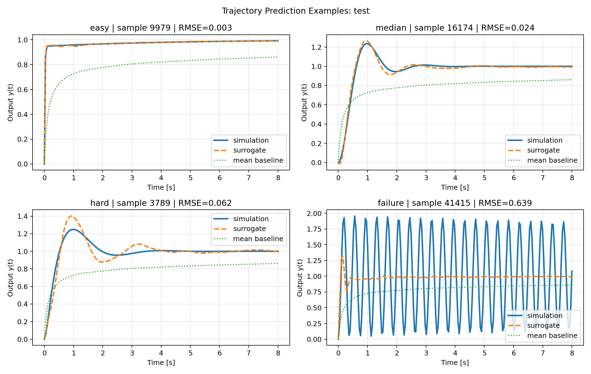
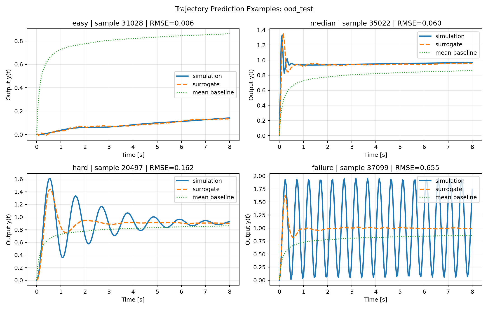

# controlsimulator

`controlsimulator` is a research-grade starter repo for learning fast surrogate models of PID-controlled continuous-time systems. The project focuses on a practical first version:

- continuous-time, stable, SISO LTI plants
- unity-feedback closed loops
- unit-step setpoint responses on a fixed time grid
- a stability classifier trained on all sampled controllers
- a trajectory regressor trained only on stable closed loops

The goal is not to claim novelty. The goal is to ship a clean, reproducible baseline that can generate data, train models, evaluate them honestly, and give you a credible place to iterate from.

## Why This Exists

Closed-loop simulation is cheap for one system but expensive inside repeated PID search, sweep, or optimization loops. A learned surrogate that predicts the full step response trajectory can be useful for:

- rapid controller screening
- approximate stability filtering
- metric prediction from trajectories
- building larger design-loop experiments without simulating every candidate online

## What Was Built

- synthetic plant generator sampled from poles and optional zeros rather than raw coefficient noise
- continuous-time PID controller with finite derivative filter
- closed-loop simulator and response-metric extraction
- chunked, resumable dataset writer with metadata
- plant-identity train/val/test splitting with a held-out plant-family OOD split
- PyTorch MLP stability classifier
- PyTorch MLP trajectory regressor
- trivial baselines: majority-class classifier and mean-trajectory regressor
- evaluation and runtime benchmarking pipelines
- tests, linting, pre-commit, and CI

## Quickstart

```bash
uv sync --group dev
make test
make generate-smoke-data
make train-smoke
make evaluate-smoke
make benchmark-smoke
make demo
```

For the larger run:

```bash
make overnight
```

The main CLI is also available directly:

```bash
uv run controlsimulator --help
```

## Reproducible Workflows

Smoke workflow:

- dataset config: `configs/datasets/smoke.yaml`
- train config: `configs/training/smoke.yaml`
- eval config: `configs/evaluation/smoke.yaml`

Full workflow:

- dataset config: `configs/datasets/full.yaml`
- train config: `configs/training/full.yaml`
- eval config: `configs/evaluation/full.yaml`

Generated datasets land under `artifacts/datasets/`. Checkpoints and train histories land under `artifacts/runs/`. These are gitignored. Committed reports and plots are stored under `reports/evaluations/`.

## Data Generation

Plants are sampled from four bounded families:

1. first-order stable
2. second-order stable
3. third-order stable
4. lightly damped second-order

Key simulation choices:

- controller: `C(s) = Kp + Ki/s + Kd*s/(tau_d*s + 1)` with `tau_d = 0.05`
- closed loop: unity feedback
- response: unit step
- horizon: 8 s
- grid: 160 points for smoke, 200 points for full

Plant representation uses:

- padded numerator coefficients
- padded denominator coefficients
- DC gain
- dominant pole magnitude
- mean pole magnitude
- plant order

Model inputs also include PID gains and log-gains.

Controller gains are sampled around heuristic plant-scaled seeds with log-uniform multipliers. The final ranges used in both shipped configs are:

- `Kp` multiplier in `[0.02, 50.0]`
- `Ki` multiplier in `[0.01, 80.0]`
- `Kd` multiplier in `[0.001, 25.0]`

These ranges were widened after an initial run produced too few unstable closed loops to make the stability task meaningful.

## Modeling Approach

The repo uses two separate models:

1. Stability classifier
   Predicts whether a sampled plant-plus-PID controller produces a stable closed loop.

2. Trajectory regressor
   Predicts the full stable step response trajectory `y(t_1...t_N)` from plant features and PID gains.

Design choices:

- MLP baselines first, no exotic architecture before end-to-end reliability
- feature standardization
- stable-only regression targets
- early stopping on validation metrics
- saved checkpoints and train histories

## Evaluation Methodology

The repo reports three main categories:

1. Held-out plants
   Splits are by `plant_id`, never by row, to avoid leakage across multiple controllers sampled from the same plant.

2. Unseen plant family
   The full `lightly_damped_second_order` family is held out as `ood_test`.

3. Runtime
   Direct simulation is benchmarked against surrogate inference.

Derived metrics are computed from both true and predicted trajectories:

- overshoot in percent
- rise time
- settling time
- steady-state error

Because the regressor is trained only on stable systems, trajectory metrics are reported only on truly stable samples. The classifier is evaluated on all samples.

## Key Results From The Full Run

Full dataset (`full_v2`):

- 43,200 total controller samples from 1,800 plants
- 81.77% stable overall
- split counts: 22,944 train, 4,920 val, 4,944 test, 10,392 OOD
- stable train samples for regression: 18,615

Stability classification:

| Split | Accuracy | F1 | Majority Accuracy |
| --- | ---: | ---: | ---: |
| Test | 0.9816 | 0.9884 | 0.7994 |
| OOD | 0.9607 | 0.9771 | 0.8462 |

Stable-trajectory regression:

| Split | Stable Samples | Traj RMSE | Mean Baseline RMSE | Traj MAE | Mean Baseline MAE |
| --- | ---: | ---: | ---: | ---: | ---: |
| Test | 3,952 | 0.0659 | 0.2971 | 0.0275 | 0.2346 |
| OOD | 8,794 | 0.1218 | 0.3267 | 0.0637 | 0.2516 |

Derived metric accuracy on stable samples:

| Split | Overshoot MAE (pct-pts) | Rise-Time MAE (s) | Settling-Time MAE (s) | SSE MAE |
| --- | ---: | ---: | ---: | ---: |
| Test | 4.22 | 0.104 | 1.096 | 0.0162 |
| OOD | 9.97 | 0.173 | 1.592 | 0.0281 |

Metric coverage notes:

- rise time was defined for 71.2% of stable test predictions and 70.3% of stable OOD predictions
- settling time was defined for 43.3% of stable test predictions and 25.5% of stable OOD predictions

Runtime benchmark on the full run:

| Benchmark | Simulator | Surrogate | Speedup |
| --- | ---: | ---: | ---: |
| Single sample | 1.382 ms | 0.112 ms | 12.36x |
| Batch of 256 | 0.599 s | 0.00298 s | 201.24x |

Representative plots:





## Repo Structure

```text
controlsimulator/
  configs/
  reports/
  src/controlsimulator/
  tests/
  Makefile
  pyproject.toml
```

Key package files:

- `plants.py`: plant-family sampling and PID gain heuristics
- `simulate.py`: closed-loop construction and simulation
- `metrics.py`: control metric extraction
- `dataset.py`: chunked dataset generation and loading
- `train.py`: model training and checkpointing
- `evaluate.py`: held-out and OOD evaluation
- `benchmark.py`: runtime comparison
- `cli.py`: command-line entry point

## Tests And Quality

```bash
make lint
make test
```

The test suite covers:

- stable plant generation
- known closed-loop simulation behavior
- metric extraction on analytic curves
- split leakage prevention
- model output shapes
- a tiny end-to-end smoke pipeline

## Limitations

- Scope is intentionally bounded to stable SISO LTI plants with no delay, saturation, noise, or actuator limits.
- The OOD split is only one held-out family, not a comprehensive generalization study.
- The regressor handles only stable closed loops; unstable responses are classified but not regressed.
- Settling-time coverage is the weakest derived metric because oscillatory tails are hard to reproduce exactly within the fixed 8 s horizon.
- The trivial mean-trajectory baseline is useful for context, but some derived metrics are undefined for it because the average response does not always cross 10%/90% or settle within the window.

## Next Steps

See `NEXT_STEPS.md` and `reports/overnight_report.md` for the highest-leverage follow-on work.
