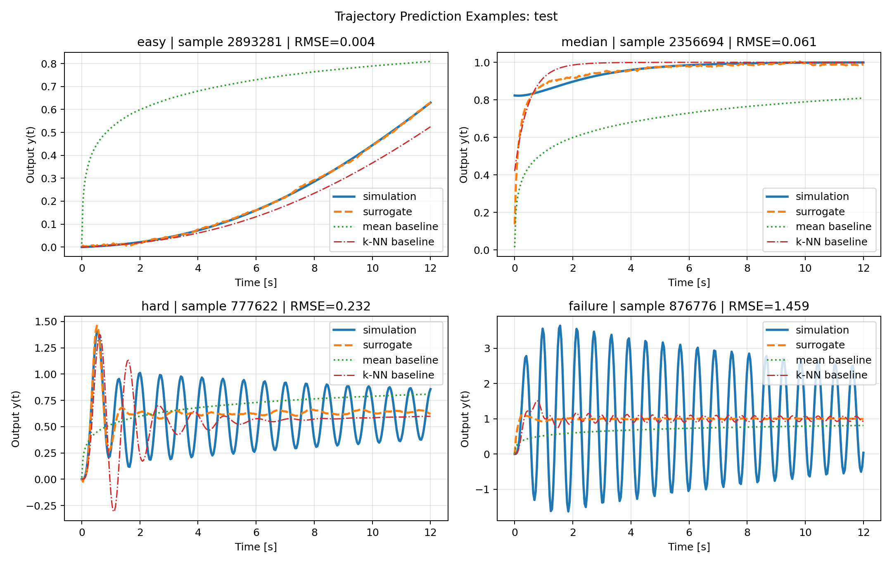
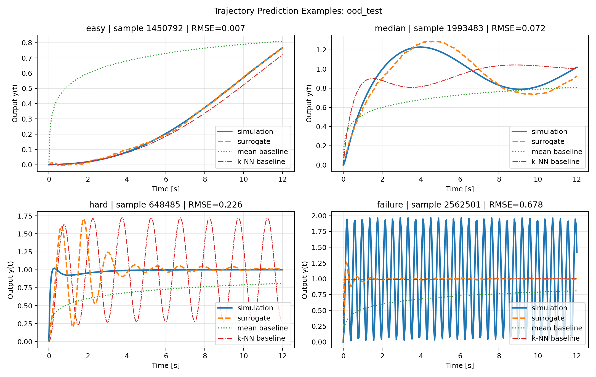
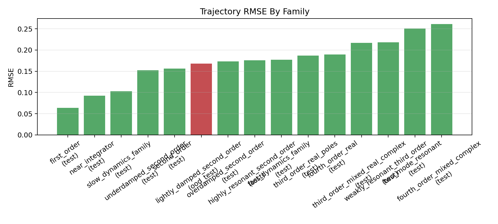
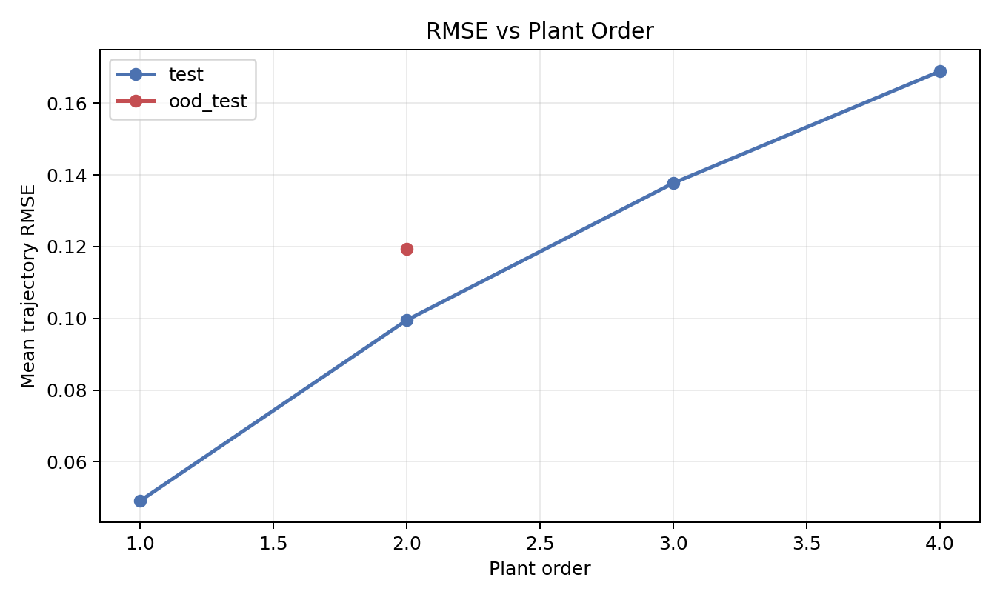

# controlsimulator

`controlsimulator` is a research-grade Python starter repo for learning surrogate models of PID-controlled continuous-time systems. The current repository includes:

- stable SISO LTI plant sampling from poles and optional zeros
- PID closed-loop simulation with a finite derivative filter
- deterministic chunked dataset generation
- plant-level train/val/test splitting with an explicit OOD family holdout
- stability classification on all samples
- stable-only trajectory regression
- evaluation, benchmarking, diagnostics, and plots

The point of the project is practical: build a clean, reproducible baseline that can scale into the multi-million-sample regime without turning into a notebook prototype or hiding failure cases.

## Why This Exists

Closed-loop simulation is cheap for one plant-controller pair and expensive inside repeated search loops. A learned surrogate can help with:

- rapid controller screening
- approximate stability filtering
- trajectory prediction without re-simulating every candidate
- downstream metric estimation from predicted trajectories

## Quickstart

```bash
make setup
make test
make generate-smoke-data
make train-smoke
make evaluate-smoke
make benchmark-smoke
```

Full v4 workflow:

```bash
make overnight
```

Third-order campaign smoke workflow:

```bash
make campaign-smoke
```

Third-order overnight campaign:

```bash
make overnight-campaign
```

Direct CLI:

```bash
PYTHONPATH=src UV_NO_EDITABLE=1 uv run python -m controlsimulator --help
```

## Reproducible Workflows

Smoke workflow:

- dataset config: `configs/datasets/smoke_v4.yaml`
- train config: `configs/training/smoke_v4.yaml`
- eval config: `configs/evaluation/smoke_v4.yaml`

Full workflow:

- dataset config: `configs/datasets/full_v4.yaml`
- train config: `configs/training/training_v4.yaml`
- eval config: `configs/evaluation/evaluation_v4.yaml`

Third-order campaign workflow:

- dataset config: `configs/datasets/third_order_campaign.yaml`
- train config: `configs/training/third_order_campaign.yaml`
- eval config: `configs/evaluation/third_order_campaign.yaml`

Third-order campaign smoke workflow:

- dataset config: `configs/datasets/campaign_smoke.yaml`
- train config: `configs/training/campaign_smoke.yaml`
- eval config: `configs/evaluation/campaign_smoke.yaml`

Generated datasets live under `artifacts/datasets/`. Runs and checkpoints live under `artifacts/runs/`. Diagnostic plots are mirrored into `artifacts/plots/`. These directories are gitignored. Committed evaluation summaries and plots live under `reports/evaluations/`.

## Data Generation

### Plant Families

`full_v4` samples from 15 stable families:

1. `first_order`
2. `second_order`
3. `underdamped_second_order`
4. `overdamped_second_order`
5. `lightly_damped_second_order`
6. `highly_resonant_second_order`
7. `third_order_real_poles`
8. `third_order_mixed_real_complex`
9. `weakly_resonant_third_order`
10. `fourth_order_real`
11. `fourth_order_mixed_complex`
12. `two_mode_resonant`
13. `near_integrator`
14. `slow_dynamics_family`
15. `fast_dynamics_family`

`lightly_damped_second_order` remains fully held out as the OOD family.

### Controller And Simulation Setup

- controller: `C(s) = Kp + Ki/s + Kd*s/(tau_d*s + 1)`
- derivative filter: `tau_d = 0.05`
- closed loop: unity feedback
- response: unit step
- horizon: 12 s
- sampling grid: 300 points

### Gain Sampling

The v4 generator uses a deterministic mixture:

- 40% wide random sampling from heuristic-scaled log-uniform gain ranges
- 40% boundary search around stable/unstable brackets
- 20% oscillation-targeted search biased toward low-damping, near-boundary closed loops

Multiplier ranges:

- `Kp` in `[0.02, 50.0]`
- `Ki` in `[0.01, 80.0]`
- `Kd` in `[0.001, 25.0]`

### Storage And Reproducibility

- metadata chunks: Parquet
- trajectory chunks: compressed NumPy `.npz`
- plant-level splits: saved explicitly in `plant_splits.parquet`
- generation: deterministic by `plant_id` seed and deterministic across worker counts
- dataset directories: fingerprinted so stale chunks from a different config are rejected
- large datasets: kept chunk-native instead of forcing a single monolithic trajectory array

## Modeling Approach

Two separate MLP baselines are trained:

1. Stability classifier
   Predicts whether a sampled plant-plus-controller pair is usable and stable.

2. Trajectory regressor
   Predicts the full stable step-response trajectory `y(t_1...t_N)`.

Design choices:

- stable-only regression targets
- standardized plant and gain features
- early stopping
- saved checkpoints and train histories
- simple baselines for context:
  - majority-class stability baseline
  - mean-trajectory baseline
  - capped 1-NN trajectory baseline in standardized feature space

## Evaluation Methodology

The repository reports:

1. Held-out plant evaluation
   Splits are by `plant_id`, never by row.

2. Held-out family OOD evaluation
   `lightly_damped_second_order` is never seen in training.

3. Runtime benchmarking
   Direct simulation vs surrogate inference.

4. Derived metric accuracy
   Overshoot, rise time, settling time, and steady-state error are recomputed from both true and predicted trajectories.

5. Diagnostic plots
   Response overlays, family-level performance, stability boundary slices, error histograms, and error-vs-frequency / damping / order plots.

## Key Results From The Full V4 Run

Dataset `full_v4`:

- 3,456,000 total samples
- 96,000 plants
- 36 controllers per plant
- 69.17% stable overall
- 15 plant families
- OOD family: `lightly_damped_second_order`
- on-disk size: 2,736,977,390 bytes, about 2.55 GiB
- generation wall time: 1,579.71 s, about 26.3 min

Split counts:

- train: 2,257,920
- val: 483,840
- test: 483,876
- ood_test: 230,364

Stable fractions by split:

- train: 68.96%
- val: 69.03%
- test: 68.82%
- ood_test: 72.25%

### Stability Classification

| Split | Accuracy | Precision | Recall | F1 | Majority Accuracy | Majority F1 |
| --- | ---: | ---: | ---: | ---: | ---: | ---: |
| Test | 0.7980 | 0.9654 | 0.7328 | 0.8332 | 0.6882 | 0.8153 |
| OOD | 0.7625 | 0.9997 | 0.6715 | 0.8034 | 0.7225 | 0.8389 |

Interpretation:

- the classifier still beats majority accuracy
- it becomes much more conservative on the held-out lightly damped OOD family
- on OOD, majority F1 is actually better than the trained classifier F1 because the classifier trades recall for near-perfect precision

### Stable-Trajectory Regression

| Split | Stable Samples | Traj RMSE | Traj MAE | Mean Baseline RMSE | 1-NN Baseline RMSE |
| --- | ---: | ---: | ---: | ---: | ---: |
| Test | 333,011 | 0.1728 | 0.0912 | 0.4311 | 0.3719 |
| OOD | 166,445 | 0.1679 | 0.0927 | 0.3603 | 0.3364 |

The surrogate remains clearly better than both baselines, but the absolute error is materially worse than the earlier `full_v3` run because the v4 dataset is much broader and harder.

### Derived Metric Error

| Split | Overshoot MAE | Rise-Time MAE | Settling-Time MAE | SSE MAE |
| --- | ---: | ---: | ---: | ---: |
| Test | 10.25 pct-pts | 0.400 s | 4.339 s | 0.0782 |
| OOD | 13.43 pct-pts | 0.219 s | 4.832 s | 0.0794 |

Coverage:

- rise time was defined for 66.77% of stable test predictions and 86.09% of stable OOD predictions
- settling time was defined for 24.76% of stable test predictions and 37.64% of stable OOD predictions

### Runtime

| Benchmark | Simulator | Surrogate | Speedup |
| --- | ---: | ---: | ---: |
| Single sample | 1.465 ms | 2.758 ms | 0.53x |
| Batch of 512 | 0.888 s | 0.00556 s | 159.70x |

The full benchmark was run on `mps`. Single-example surrogate inference is slower than direct simulation because of device launch overhead, but batch inference remains much faster.

### Where The Model Fails

Regression is easiest on:

- `first_order`: test RMSE `0.0637`
- `near_integrator`: test RMSE `0.0927`
- `slow_dynamics_family`: test RMSE `0.1029`

Regression is hardest on:

- `fourth_order_mixed_complex`: test RMSE `0.2611`
- `two_mode_resonant`: test RMSE `0.2506`
- `weakly_resonant_third_order`: test RMSE `0.2183`

Mean test RMSE rises strongly with plant order:

- order 1: `0.0491`
- order 2: `0.0995`
- order 3: `0.1377`
- order 4: `0.1689`

Representative plots:









## Scaling Effects vs V3

`full_v3` used 512k samples from 16k plants and 8 plant families. `full_v4` expanded that to 3.456M samples from 96k plants and 15 plant families, while also extending the horizon from 8 s / 200 steps to 12 s / 300 steps.

That broader dynamics space made the task much harder:

- test classifier accuracy fell from `0.9127` to `0.7980`
- OOD classifier accuracy fell from `0.8745` to `0.7625`
- test trajectory RMSE rose from `0.0902` to `0.1728`
- OOD trajectory RMSE rose from `0.1344` to `0.1679`
- all reported derived-metric MAEs became worse

This is not a “better score” result. It is a better benchmark result. `full_v4` is a more challenging and more useful stress test for future research.

## Repo Structure

```text
controlsimulator/
  configs/
  reports/
  src/controlsimulator/
  tests/
  Makefile
  pyproject.toml
```

Key files:

- `plants.py`: plant-family sampling and gain heuristics
- `simulate.py`: closed-loop construction and stability checks
- `dataset.py`: deterministic, chunked, parallel dataset generation
- `train.py`: chunk-streamed classifier and regressor training
- `evaluate.py`: held-out, OOD, family-level, and diagnostic evaluation
- `benchmark.py`: runtime comparison

## Tests And Quality

```bash
make lint
make test
```

## Limitations

- the classifier is now only modestly better than a majority baseline on OOD
- fourth-order and multi-mode resonant families remain hard for the regressor
- the benchmark is hardware-sensitive; on MPS, single-sample surrogate inference is slower than direct simulation
- the simulator still covers only stable continuous-time SISO LTI plants with unity feedback
- delays, saturation, sensor noise, and nonlinear dynamics are out of scope in v1

## Next Steps

See `NEXT_STEPS.md` for the current highest-leverage follow-ups.
