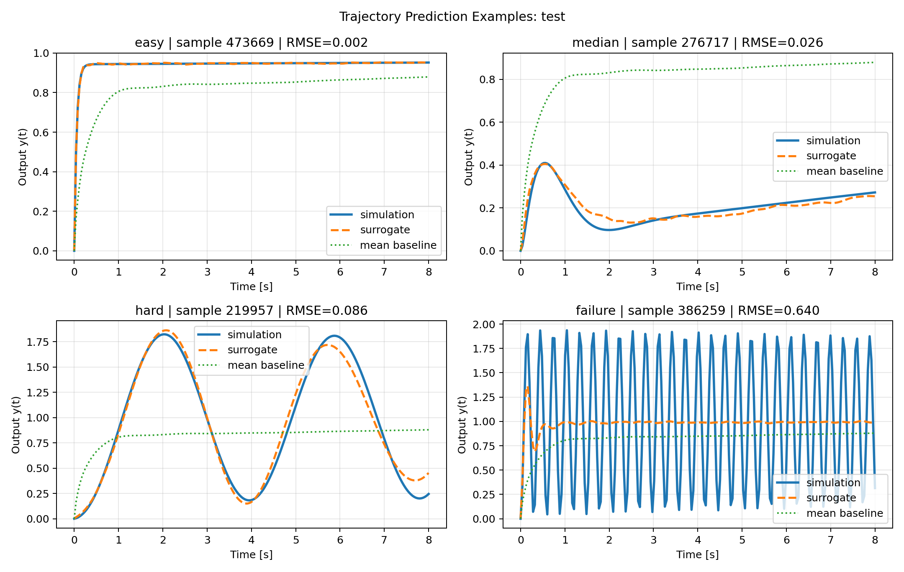
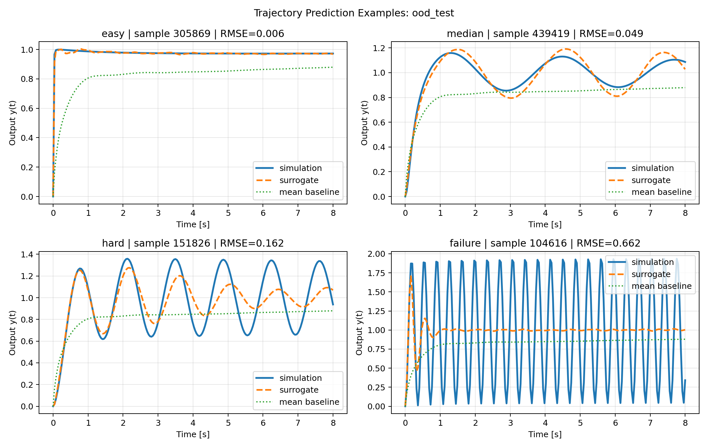
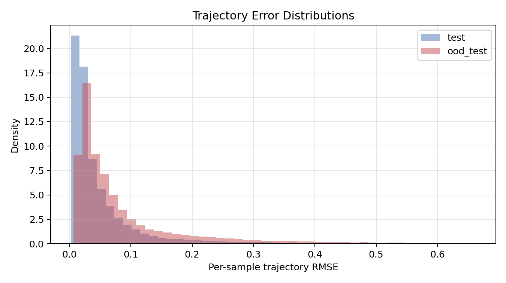

# controlsimulator

`controlsimulator` is a research-grade Python starter repo for learning surrogate models of PID-controlled continuous-time systems. The current version ships a clean end-to-end pipeline for:

- stable SISO LTI plant sampling from poles and optional zeros
- PID closed-loop simulation with finite derivative filter
- chunked dataset generation with deterministic seeds
- plant-level train/val/test splitting
- stability classification on all samples
- stable-only trajectory regression
- evaluation, benchmarking, diagnostics, and plots

The project goal is practical and honest: produce a reproducible baseline that can scale to large synthetic datasets without turning into a notebook prototype or hiding failure cases.

## Why This Exists

Step-response simulation is cheap for one plant-controller pair but expensive inside repeated search or optimization loops. A learned surrogate can be useful for:

- rapid controller screening
- approximate stability filtering
- trajectory prediction without re-simulating every candidate
- downstream control-metric estimation from predicted responses

## Quickstart

```bash
uv sync --group dev
make test
make generate-smoke-data
make train-smoke
make evaluate-smoke
make benchmark-smoke
```

Full scaled run:

```bash
make overnight
```

CLI entry point:

```bash
uv run controlsimulator --help
```

## Reproducible Workflows

Smoke workflow:

- dataset config: `configs/datasets/smoke.yaml`
- train config: `configs/training/smoke.yaml`
- eval config: `configs/evaluation/smoke.yaml`

Scaled workflow:

- dataset config: `configs/datasets/full.yaml`
- train config: `configs/training/full.yaml`
- eval config: `configs/evaluation/full.yaml`

Generated datasets are written under `artifacts/datasets/`. Runs and checkpoints are written under `artifacts/runs/`. Diagnostic and analysis plots are written under `artifacts/plots/`. These directories are gitignored. Committed reports and selected evaluation plots live under `reports/evaluations/`.

## Data Generation

### Plant Families

The scaled pipeline now samples from eight stable families:

1. `first_order`
2. `second_order`
3. `underdamped_second_order`
4. `overdamped_second_order`
5. `third_order_real_poles`
6. `third_order_mixed_real_complex`
7. `lightly_damped_second_order`
8. `weakly_resonant_third_order`

`lightly_damped_second_order` remains fully held out as the OOD family.

### Controller And Simulation Setup

- controller: `C(s) = Kp + Ki/s + Kd*s/(tau_d*s + 1)` with `tau_d = 0.05`
- closed loop: unity feedback
- response: unit step
- horizon: 8 s
- sampling grid: 160 points for smoke, 200 points for full

### Gain Sampling

Gains are sampled with a deterministic mixture strategy:

- 50% wide random sampling from heuristic-scaled log-uniform ranges
- 50% targeted boundary sampling using stable/unstable bracketing and local perturbation

Shipped multiplier ranges:

- `Kp` in `[0.02, 50.0]`
- `Ki` in `[0.01, 80.0]`
- `Kd` in `[0.001, 25.0]`

### Storage And Reproducibility

- metadata chunks: Parquet
- trajectories: compressed NumPy `.npz`
- final dataset metadata includes family-wise stability, failure counts, timing, and disk usage
- generation is deterministic by `plant_id` seed and remains deterministic across worker counts
- dataset directories are fingerprinted so stale chunks from a different config are rejected

## Modeling Approach

Two separate MLP baselines are trained:

1. Stability classifier
   Predicts whether a sampled plant-plus-PID controller is usable and stable under the simulator’s safety rules.

2. Trajectory regressor
   Predicts the full stable step-response trajectory `y(t_1...t_N)`.

Design choices:

- stable-only regression targets
- standardized input features
- early stopping
- saved checkpoints and train histories
- simple baselines for context:
  - majority-class stability predictor
  - mean-trajectory regressor

## Evaluation Methodology

The repo reports:

1. Held-out plant evaluation
   Splits are by `plant_id`, never by row.

2. Held-out family OOD evaluation
   `lightly_damped_second_order` is never seen in training.

3. Runtime benchmarking
   Direct simulation vs surrogate inference.

4. Derived metric accuracy
   Overshoot, rise time, settling time, and steady-state error are recomputed from both true and predicted trajectories.

5. Diagnostic plots
   Response overlays, per-sample error distributions, family-level performance, gain distributions, and PID stability slices.

## Key Results From The Scaled Run

Scaled dataset (`full_v3`):

- 512,000 total controller samples
- 16,000 plants
- 32 controllers per plant
- 67.99% stable overall
- 157,159 mathematically unstable closed loops
- 6,721 additional samples rejected for control-effort limit
- dataset disk usage: 536,224,027 bytes, about 511 MiB
- generation wall time: 192.49 s

Split counts:

- train: 313,728
- val: 67,264
- test: 67,264
- ood_test: 63,744

Stable fractions by split:

- train: 67.94%
- val: 68.24%
- test: 68.40%
- ood_test: 67.55%

### Stability Classification

| Split | Accuracy | Precision | Recall | F1 | Majority Accuracy |
| --- | ---: | ---: | ---: | ---: | ---: |
| Test | 0.9127 | 0.9908 | 0.8805 | 0.9324 | 0.6840 |
| OOD | 0.8745 | 0.9470 | 0.8625 | 0.9028 | 0.6755 |

### Stable-Trajectory Regression

| Split | Stable Samples | Traj RMSE | Mean Baseline RMSE | Traj MAE | Mean Baseline MAE |
| --- | ---: | ---: | ---: | ---: | ---: |
| Test | 46,011 | 0.0902 | 0.3618 | 0.0399 | 0.2786 |
| OOD | 43,057 | 0.1344 | 0.3448 | 0.0687 | 0.2647 |

### Derived Metric Error

| Split | Overshoot MAE | Rise-Time MAE | Settling-Time MAE | SSE MAE |
| --- | ---: | ---: | ---: | ---: |
| Test | 3.59 pct-pts | 0.073 s | 0.976 s | 0.0454 |
| OOD | 6.21 pct-pts | 0.099 s | 1.425 s | 0.0638 |

Coverage:

- rise time was defined for 79.35% of stable test predictions and 81.23% of stable OOD predictions
- settling time was defined for 29.91% of stable test predictions and 21.36% of stable OOD predictions

### Runtime

| Benchmark | Simulator | Surrogate | Speedup |
| --- | ---: | ---: | ---: |
| Single sample | 1.145 ms | 0.111 ms | 10.35x |
| Batch of 512 | 0.689 s | 0.00212 s | 324.50x |

### Scaling Effects vs The Earlier 43k Run

The earlier `full_v2` dataset had 43,200 samples from 1,800 plants. Scaling to 512k samples made the task harder:

- classifier accuracy dropped from `0.9816` to `0.9127` on held-out plants
- classifier OOD accuracy dropped from `0.9607` to `0.8745`
- trajectory RMSE rose from `0.0659` to `0.0902` on held-out plants
- OOD trajectory RMSE rose from `0.1218` to `0.1344`

That drop is not a regression in pipeline quality so much as a result of a broader, more realistic data distribution. At the same time, several derived metrics improved:

- overshoot MAE improved on both ID and OOD
- rise-time MAE improved on both ID and OOD
- settling-time MAE improved on both ID and OOD

Steady-state error MAE became worse, which is one of the clearer remaining weaknesses of the scaled regressor.

Representative plots:







## Repo Structure

```text
controlsimulator/
  configs/
  reports/
  src/controlsimulator/
  tests/
  Makefile
  pyproject.toml
```

Key package files:

- `plants.py`: plant-family sampling and gain heuristics
- `simulate.py`: closed-loop construction and stability checks
- `dataset.py`: deterministic, chunked, parallel dataset generation
- `train.py`: classifier and regressor training
- `evaluate.py`: held-out, OOD, family-level, and plotting evaluation
- `benchmark.py`: runtime comparison

## Tests And Quality

```bash
make lint
make test
```

The test suite covers:

- stable plant generation across families
- known closed-loop behavior
- metric extraction correctness
- split leakage prevention
- model output shapes
- deterministic generation across worker counts
- config-mismatch protection for resumable datasets
- a tiny end-to-end smoke pipeline

## Limitations

- Scope is still bounded to stable SISO LTI plants with no delays, saturation, noise, or nonlinearities.
- The OOD study is only one held-out family, not a broad suite of distribution shifts.
- First-order plants remain almost entirely stable under positive PID gains, so the classifier boundary is less informative there.
- The regressor still struggles most on oscillatory tails and on steady-state bias under the broader family mix.
- Control-effort rejection is currently a simple threshold, not a modeled actuator-limit framework.

## Next Steps

See `NEXT_STEPS.md` and `reports/overnight_report.md`.
